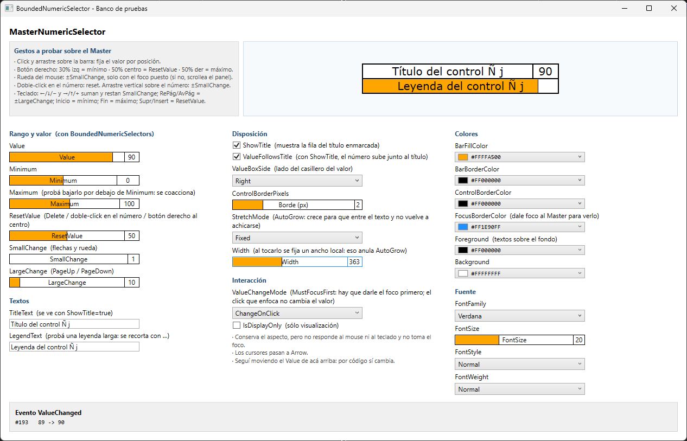

# NumericSelector

Control WPF *lookless* para seleccionar un valor entero **acotado a un rango**: no hay forma de que el control entregue un valor fuera de `[Minimum, Maximum]`, así que el consumidor no necesita validar la entrada. La barra permite elegir el valor; la leyenda se escribe sobre ella y el número permanece siempre legible.

El control se llama **`BoundedNumericSelector`** y vive en el ensamblado `NumericSelector`.

> Estado: la API quedó definida y el control está listo para una primera versión estable. Pendiente: empaquetado NuGet y CI.



## Qué aporta

- Entrada discreta de tipo `int`, con rango, pasos y valor de reinicio.
- Valor visible sin saltos de ancho ni recortes, incluso con miles, signos y cambios de cultura.
- Interacción con mouse, teclado y rueda, cuidando no interferir con un `ScrollViewer` contenedor.
- Disposición configurable: el casillero del valor vive junto a la barra (a la izquierda o derecha) o sube junto al título, según tres propiedades simples.
- Modo de sólo visualización que conserva la apariencia y sigue reflejando cambios hechos por código.
- Plantilla y colores personalizables, sin heredar la semántica de `Slider`.

| Plataforma | Ensamblado | Control | Valor |
| --- | --- | --- | --- |
| .NET 10 · WPF · Windows | `NumericSelector` | `BoundedNumericSelector` | `int` |

## Instalación y uso rápido

Por ahora, agregá una referencia al proyecto `NumericSelector` desde tu aplicación WPF. El paquete NuGet está planificado, pero todavía no se publica.

```xml
<Window
    xmlns="http://schemas.microsoft.com/winfx/2006/xaml/presentation"
    xmlns:x="http://schemas.microsoft.com/winfx/2006/xaml"
    xmlns:ns="clr-namespace:NumericSelector;assembly=NumericSelector">

    <ns:BoundedNumericSelector
        Minimum="0"
        Maximum="100"
        Value="50"
        ResetValue="50"
        LegendText="Volumen"
        ValueChanged="Selector_ValueChanged" />
</Window>
```

```csharp
private void Selector_ValueChanged(
    object sender,
    RoutedPropertyChangedEventArgs<int> e)
{
    // e.OldValue y e.NewValue
}
```

`Value` usa binding bidireccional por defecto, por lo que alcanza con `Value="{Binding MiPropiedad}"`.

## Galería de disposiciones

La vista previa representa la aplicación de demostración incluida. La posición del casillero del valor se decide con tres propiedades independientes (`ShowDetail`, `ValueFollowsDetail` y `ValueBoxSide`):

- **Sin detalle** (`ShowDetail=false`, predeterminado): sólo la fila de la barra, con la leyenda sobre el relleno y el casillero del valor junto a la barra, a la derecha por defecto.
- **Detalle con el número arriba** (`ShowDetail=true`, `ValueFollowsDetail=false`): la barra y el casillero arriba, la etiqueta del detalle ocupando todo el ancho en la fila inferior.
- **Número junto al detalle** (`ShowDetail=true`, `ValueFollowsDetail=true`): el casillero baja a la línea del detalle y la barra queda sola; la caja va a la derecha o izquierda del detalle según `ValueBoxSide`.

## Interacción

### Mouse

| Gesto | Efecto |
| --- | --- |
| Click o arrastre sobre la barra | Lleva el valor a la posición del puntero. |
| Click derecho sobre la barra | 30% izquierdo → `Minimum`; 40% central → `ResetValue`; 30% derecho → `Maximum`. |
| Doble click sobre el número | Restablece `ResetValue`. |
| Arrastre vertical sobre el número | Cambia de a `SmallChange`; hacia arriba aumenta. |
| Rueda | Cambia de a `SmallChange`, sólo si el control tiene el foco. |

La restricción de foco de la rueda evita cambios accidentales cuando el selector está dentro de un `ScrollViewer`.

### Teclado

| Tecla | Efecto |
| --- | --- |
| `←`, `↓`, `-` | − `SmallChange` |
| `→`, `↑`, `+` | + `SmallChange` |
| `PageDown`, `PageUp` | ∓ `LargeChange` |
| `Home`, `End` | `Minimum`, `Maximum` |
| `Delete`, `Insert` | `ResetValue` |

El foco se comunica con el color del borde (`FocusBorderColor`) en lugar del rectángulo punteado predeterminado de WPF.

## API principal

### Rango y cambios

| Propiedad | Tipo | Predeterminado | Descripción |
| --- | --- | --- | --- |
| `Value` | `int` | `0` | Valor actual, coaccionado al rango y con binding `TwoWay` por defecto. |
| `Minimum` | `int` | `0` | Límite inferior del rango. |
| `Maximum` | `int` | `100` | Límite superior; nunca queda por debajo de `Minimum`. |
| `SmallChange` | `int` | `1` | Paso de teclas, rueda y arrastre vertical. Entre `1` y el ancho del rango. |
| `LargeChange` | `int` | `10` | Paso de PageUp/PageDown. Entre `1` y el ancho del rango. |
| `ResetValue` | `int` | `50` | Valor usado por reset; también se coacciona al rango. |

El rango conserva siempre al menos una unidad de ancho. Al empujar un extremo contra el otro, el extremo se limita en vez de arrastrar su par.

Los pasos se coaccionan por ambos lados. Un paso de `0` dejaría el control inerte, y uno mayor que el rango completo no aportaría nada —salta de un extremo al otro igual que el ancho del rango— además de exhibir un número imposible. **La coacción es silenciosa:** con `Minimum="0" Maximum="5"`, asignar `LargeChange="10"` deja `LargeChange` en `5`. Si el rango cambia después, los pasos se re-evalúan contra el rango nuevo.

### Texto, disposición y tamaño

| Propiedad | Tipo | Predeterminado | Descripción |
| --- | --- | --- | --- |
| `CaptionText` | `string` | `DefaultCaption` | Leyenda sobre el relleno de la barra. |
| `DetailText` | `string` | `DefaultDetail` | Texto de la fila de detalle inferior. |
| `ShowDetail` | `bool` | `false` | Muestra la fila de detalle enmarcada. |
| `ValueFollowsDetail` | `bool` | `true` | Con `ShowDetail`, baja el casillero del valor junto al detalle; con `false`, queda junto a la barra. |
| `ValueBoxSide` | `enum` | `Right` | Lado del casillero del valor (`Right` o `Left`) respecto de su compañero de fila. |
| `StretchMode` | `enum` | `Fixed` | Estrategia de ancho. |
| `ControlBorderPixels` | `Thickness` | `1` | Grosor de los marcos. El lado `Top` es además el grosor de la línea que separa la barra de la fila de detalle. |

`StretchMode.Fixed` mantiene el `Width` disponible y aplica elipsis a los textos que no entran. `StretchMode.AutoGrow` puede ampliar el control para acomodar el contenido y no vuelve a achicarlo automáticamente.

### Interacción y apariencia

| Propiedad | Tipo | Predeterminado | Descripción |
| --- | --- | --- | --- |
| `ValueChangeMode` | `enum` | `ChangeOnClick` | Decide si el mouse actúa de inmediato o exige foco previo. |
| `IsReadOnly` | `bool` | `false` | Bloquea mouse, teclado y tabulación sin cambiar la apariencia. |
| `ControlBorderColor` | `Brush` | `Black` | Marcos sin foco. |
| `FocusBorderColor` | `Brush` | `DodgerBlue` | Marcos con foco. |
| `BarFillColor` | `Brush` | `Orange` | Relleno proporcional de la barra. |
| `BarBorderColor` | `Brush` | `Black` | Contorno del relleno. |

`ValueChangeMode.MustFocusFirst` hace que el primer click que obtiene el foco no modifique el valor; los gestos posteriores sí. `IsReadOnly` bloquea al usuario, no al programa: asignar `Value` desde código sigue actualizando el control y disparando `ValueChanged`.

El control se dibuja como **cuatro celdas independientes** —barra y caja del valor arriba, etiqueta del detalle y caja del detalle abajo—, cada una con su marco. **Cuáles** lados dibuja cada una lo resuelve una única matriz de costuras (`ValueBorderResolver`), con una regla única: *la barra y el detalle son el marco fijo, y la caja del valor cede el lado que mira a su compañero de fila*. Así ningún filo se dibuja dos veces. La costura horizontal entre filas la dibuja siempre el borde superior de la fila de detalle, que además hace de borde superior de la fila de la barra.

Cada una de las tres propiedades de disposición hace algo en todo momento, sin estados inválidos ni degradaciones que documentar:

- `ShowDetail` decide si existe la fila de detalle.
- `ValueFollowsDetail` decide, sólo cuando hay detalle, si el casillero baja a esa fila (`true`) o se queda junto a la barra (`false`).
- `ValueBoxSide` decide a qué lado del compañero de fila cae el casillero: del detalle si bajó, de la barra si no.

No hay dependencias entre propiedades: cualquier combinación es válida y produce un dibujo cerrado.

`IsEnabled = false` (heredado de `UIElement`) también deja el control fuera del alcance del usuario, y a diferencia de `IsReadOnly` altera la apariencia según el tema. Si el control tenía el foco al deshabilitarse, lo suelta.

## Garantía de legibilidad

El control calcula un `MinWidth` a partir del mayor número que el rango puede producir. La medición tiene en cuenta fuente, grosor del borde y `Language`, por lo que los formatos `1.000` (`es-AR`) y `1,000` (`en-US`) reservan el espacio correcto. La leyenda puede truncarse; el número no.

## Aplicación de demostración

El proyecto `NumericSelector.Demo` permite probar visualmente todas las propiedades, fuentes, colores, rangos y gestos. El control en prueba ocupa una fila superior de alto fijo y las opciones se distribuyen en tres columnas.

```powershell
dotnet run --project .\NumericSelector.Demo\NumericSelector.Demo.csproj
```

Para compilar toda la solución:

```powershell
dotnet build .\NumericSelector.slnx --configuration Release
```

## Roadmap

- [x] Control horizontal con rango entero, teclado, mouse y rueda.
- [x] Disposición configurable (`ShowDetail`, `ValueFollowsDetail`, `ValueBoxSide`), `AutoGrow` y sólo visualización.
- [x] Demo interactivo de las propiedades públicas.
- [x] Pruebas automatizadas para defaults, coerciones de rango, pasos, disposición y eventos.
- [ ] Ampliar las pruebas a cultura, foco, gestos de mouse y `AutoGrow`.
- [ ] Contrato de plantilla documentado con `TemplatePart` para facilitar estilos alternativos.
- [ ] Validación explícita de valores inválidos en las enumeraciones públicas.
- [ ] Orientación vertical.
- [ ] Empaquetado NuGet, versionado semántico y publicación inicial `0.x`.
- [ ] Automatización de CI en GitHub Actions y capturas/GIF reales del demo.

## Límites actuales

- Sólo admite orientación horizontal.
- El dominio es intencionalmente entero: no hay soporte para decimales.
- El ancho predeterminado del estilo es `300`.
- El `FocusVisualStyle` predeterminado se desactiva; el indicador de foco es el borde.

## Desarrollo y contribuciones

El repositorio incluye una [guía de contribución](CONTRIBUTING.md), su [política de seguridad](SECURITY.md), el [changelog](CHANGELOG.md) y licencia [MIT](LICENSE). El siguiente paso recomendado antes de publicar es crear el repositorio Git remoto y sumar un workflow de GitHub Actions para `build` y `test`.
